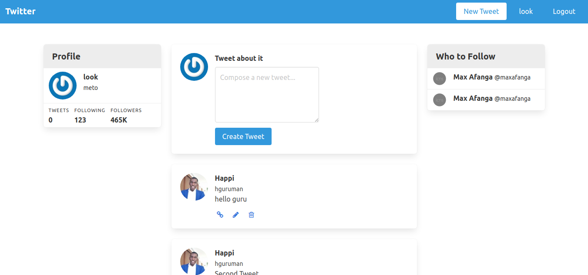
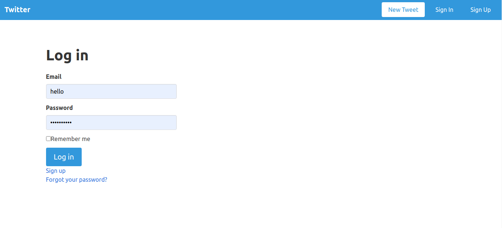

# Twitter-Clone
Twitter Clone Website

This README normally document the steps involved to run a live version of a Twitter Clone.




Things you may want to cover:

* Ruby version
- Ruby. v2.7.0
- Ruby on Rails. v6.0.3.3
- Using Rubocop Linters.
- Bulma
- Devise

## 🛠 Getting Started
## Install 
In order to run, you need to install Ruby in your computer. For windows you can go to [Ruby installer](https://rubyinstaller.org/) and for MAC and LINUX you can go to [Ruby official site](https://www.ruby-lang.org/en/downloads/) for intructions on how to intall it. Then you can clone the project by typing ```git clone git@github.com:happiguru/Twitter-Clone.git``` on your terminal or download the source code from the repository.

## Run the application
To get a local copy up and running follow these simple example steps.

- Open a terminal
- Copy this code : ```git clone "put the link from github repo"```
- Run the program with this code : ```bundle install```
- Run the program with this code : ```rails db:create rails db:migrate rails server```
- Stop the program with: "Ctrl + C" (Windows or Linux) or "Command + C"(Apple)

## Open app in browser

- When the program is running go to your browser
- put: localhost:3000/
- Click on login, register and Sign up as a new user
- Enjoy the app.

## ✒️ Authors

👤 **Stanley Enow Lekunze**

- Github: [@happiguru](https://github.com/happiguru)
- LinkedIn:[LinkedIn](https://www.linkedin.com/in/lekunze-nley)

## 🤝 Contributing
Contributions, issues and feature requests are welcome!

Feel free to check the [issues page](https://github.com/happiguru/Twitter-Clone/issues).

## 📝 License
This project is [MIT](lic.url) licensed.